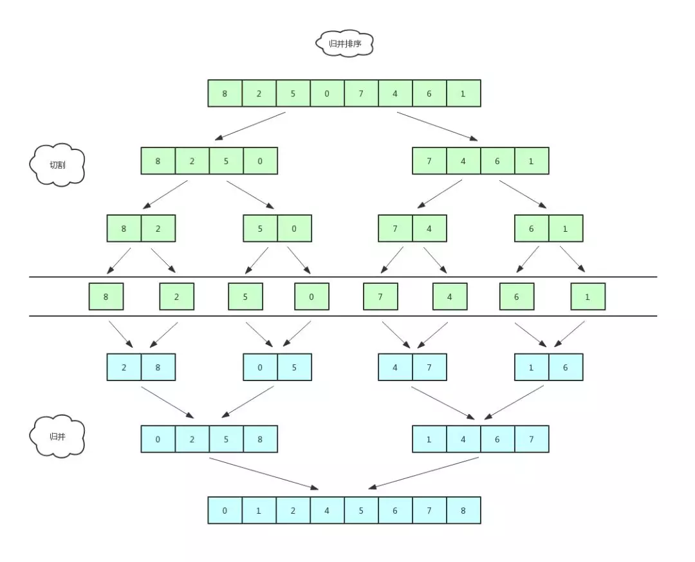
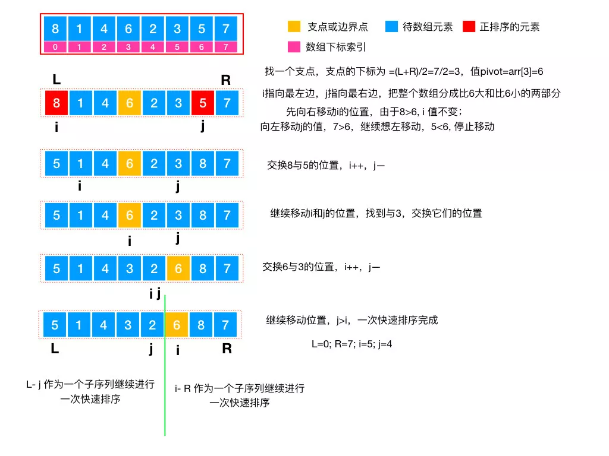
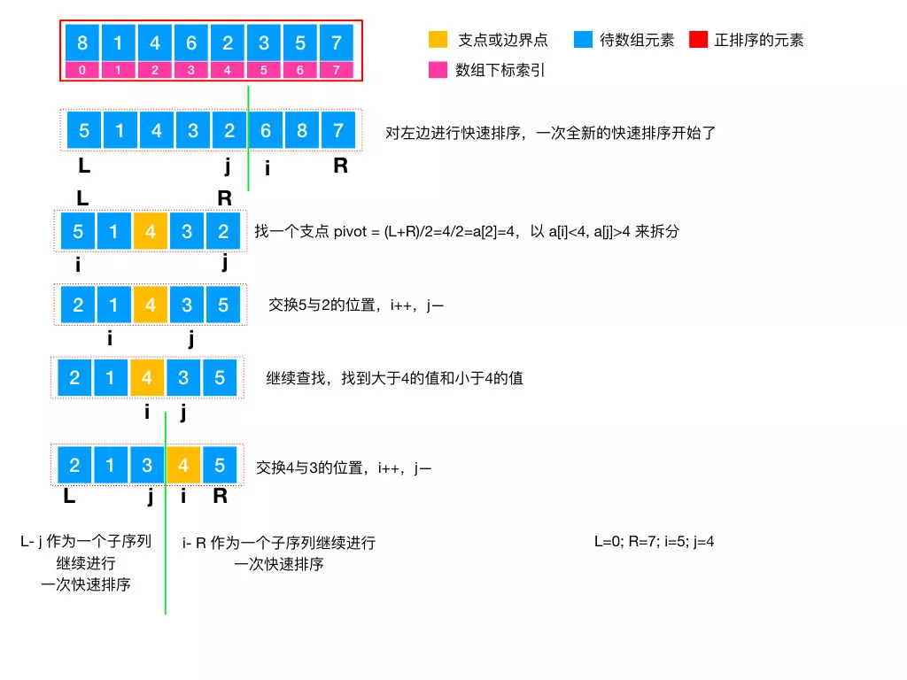
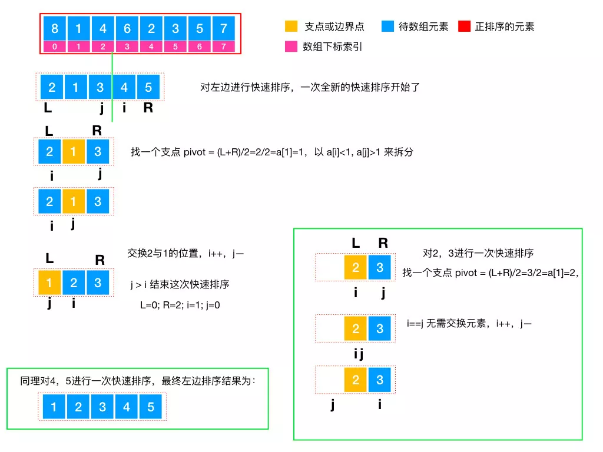
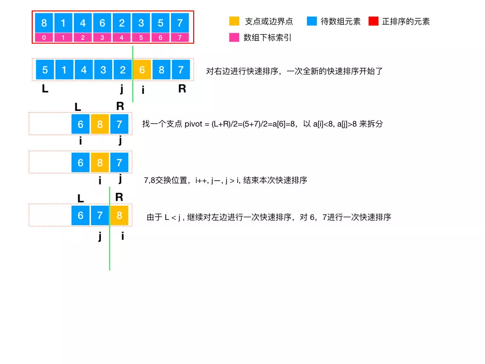
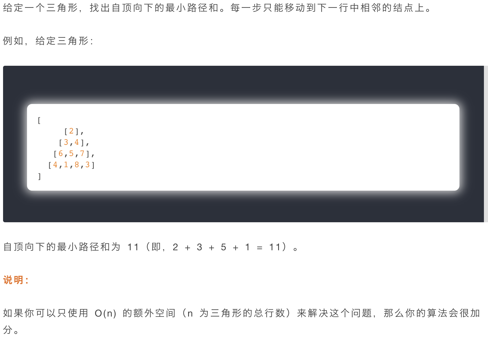

- 此目录下的文件夹为idea项目文件夹
- 收录一些代码


<!-- TOC -->

- [排序算法](#排序算法)
  - [1.冒泡排序](#1冒泡排序)
    - [1.1 算法步骤](#11-算法步骤)
    - [1.2 优化](#12-优化)
    - [1.3 特点](#13-特点)
  - [2.选择排序](#2选择排序)
    - [2.1 算法步骤](#21-算法步骤)
    - [2.2 特点](#22-特点)
  - [3.插入排序](#3插入排序)
    - [3.1 算法步骤](#31-算法步骤)
    - [3.2 特点](#32-特点)
  - [4.希尔排序](#4希尔排序)
    - [4.1 算法步骤](#41-算法步骤)
  - [5.归并排序](#5归并排序)
    - [5.1 算法步骤](#51-算法步骤)
  - [6.快速排序](#6快速排序)
    - [6.1 算法步骤](#61-算法步骤)
- [贪心算法](#贪心算法)
- [动态规划(Dynamic Programming)](#动态规划dynamic-programming)
  - [思考步骤](#思考步骤)
  - [例题](#例题)
    - [爬楼梯](#爬楼梯)
      - [解答](#解答)
        - [1.问题拆解](#1问题拆解)
        - [2.状态定义](#2状态定义)
        - [3.递推方程](#3递推方程)
        - [4.实现](#4实现)
    - [三角形最小路径和](#三角形最小路径和)
      - [解答](#解答-1)
        - [1.问题拆解](#1问题拆解-1)
        - [2.状态定义](#2状态定义-1)
        - [3.递推方程](#3递推方程-1)
        - [4.实现](#4实现-1)

<!-- /TOC -->
# 排序算法

## 1.冒泡排序
### 1.1 算法步骤
- 比较相邻的元素。如果第一个比第二个大，就交换他们两个。
- 对每一对相邻元素作同样的工作，从开始第一对到结尾的最后一对。这步做完后，最后的元素会是最大的数。
- 针对所有的元素重复以上的步骤，除了最后一个。
- 持续每次对越来越少的元素重复上面的步骤，直到没有任何一对数字需要比较。


### 1.2 优化
冒泡排序不管数组是否有序，都会执行两层循环，浪费资源。因此我们可以设置一个临时遍历来标记是否有序。
### 1.3 特点
- 稳定性：它是指对同样的数据进行排序，会不会改变它的相对位置。比如 [ 1, 3, 2, 4, 2 ] 经过排序后，两个相同的元素 2 位置会不会被交换。冒泡排序是比较相邻两个元素的大小，显然不会破坏稳定性。

- 空间复杂度：由于整个排序过程是在原数据上进行操作，故为 O(1);

- 时间复杂度：由于嵌套了 2 层循环，故为 O(n*n);
## 2.选择排序
### 2.1 算法步骤
依次从无序数组中找到最大或最小的元素放到数组最后面。

### 2.2 特点
- 稳定性：排序过程中元素是按顺序进行遍历，相同元素相对位置不会发生变化，故稳定。
- 空间复杂度：在原序列进行操作，故为 O( 1 );
- 时间复杂度：需要 2 次循环遍历，故为 O( n * n );

## 3.插入排序
### 3.1 算法步骤

### 3.2 特点
- 稳定性：它是从后往前遍历已排序好的序列，相同元素不会改变位置，故为稳定排序；
- 空间复杂度：它是在原序列进行排序，故为 O ( 1 );
- 时间复杂度：排序的过程中，首先要遍历所有的元素，然后在已排序序列中找到合适的位置并插入。共需要 2 层循环，故为 O ( n² );

## 4.希尔排序
### 4.1 算法步骤
插入排序的一种高效改进算法。核心思想是把一个序列分组，对分组后的内容进行插入排序，这里的分组只是逻辑上的分组，不会重新开辟存储空间。它其实是插入排序的优化版，插入排序对基本有序的序列性能好，希尔排序利用这一特性把原序列分组，对每个分组进行排序，逐步完成排序。


## 5.归并排序
### 5.1 算法步骤

归并字面上的意思是合并，归并算法的核心思想是分治法，就是将一个数组一刀切两半，递归切，直到切成单个元素，然后重新组装合并，单个元素合并成小数组，两个小数组合并成大数组，直到最终合并完成，排序完毕。





## 6.快速排序
### 6.1 算法步骤
快速排序的核心思想也是分治法，分而治之。它的实现方式是每次从序列中选出一个基准值，其他数依次和基准值做比较，比基准值大的放右边，比基准值小的放左边，然后再对左边和右边的两组数分别选出一个基准值，进行同样的比较移动，重复步骤，直到最后都变成单个元素，整个数组就成了有序的序列。







# 贪心算法
贪心算法是一种在每一步选择中都采取在当前状态下最好或最优的选择，从而希望得到结果是最好或最优的算法。

# 动态规划(Dynamic Programming)
> 用一句话解释动态规划就是 “记住你之前做过的事”，如果更准确些，其实是 “记住你之前得到的答案”。

## 思考步骤
- 问题拆解，找到问题之间的具体联系
- 状态定义
- 递推方程推导
- 实现

## 例题
### 爬楼梯
>假设你正在爬楼梯。需要 n 阶你才能到达楼顶。每次你可以爬 1 或 2 个台阶。你有多少种不同的方法可以爬到楼顶呢？
>注意：给定 n 是一个正整数。
#### 解答
##### 1.问题拆解
我们到达第 n 个楼梯可以从第 n – 1 个楼梯和第 n – 2 个楼梯到达，因此第 n 个问题可以拆解成第 n – 1 个问题和第 n – 2 个问题，第 n – 1 个问题和第 n – 2 个问题又可以继续往下拆，直到第 0 个问题，也就是第 0 个楼梯 (起点)

##### 2.状态定义
“问题拆解” 中已经提到了，第 n 个楼梯会和第 n – 1 和第 n – 2 个楼梯有关联，那么具体的联系是什么呢？你可以这样思考，第 n – 1 个问题里面的答案其实是从起点到达第 n – 1 个楼梯的路径总数，n – 2 同理，从第 n – 1 个楼梯可以到达第 n 个楼梯，从第 n – 2 也可以，并且路径没有重复，因此我们可以把第 i 个状态定义为 “从起点到达第 i 个楼梯的路径总数”，状态之间的联系其实是相加的关系。

##### 3.递推方程
“状态定义” 中我们已经定义好了状态，也知道第 i 个状态可以由第 i – 1 个状态和第 i – 2 个状态通过相加得到，因此递推方程就出来了 dp[i] = dp[i - 1] + dp[i - 2]

##### 4.实现
你其实可以从递推方程看到，我们需要有一个初始值来方便我们计算，起始位置不需要移动 dp[0] = 0，第 1 层楼梯只能从起始位置到达，因此 dp[1] = 1，第 2 层楼梯可以从起始位置和第 1 层楼梯到达，因此 dp[2] = 2，有了这些初始值，后面就可以通过这几个初始值进行递推得到。

### 三角形最小路径和

#### 解答
##### 1.问题拆解
这里的总问题是求出最小的路径和，路径是这里的分析重点，路径是由一个个元素组成的，和之前爬楼梯那道题目类似，[i][j] 位置的元素，经过这个元素的路径肯定也会经过 [i - 1][j] 或者 [i - 1][j - 1]，因此经过一个元素的路径和可以通过这个元素上面的一个或者两个元素的路径和得到。

##### 2.状态定义

状态的定义一般会和问题需要求解的答案联系在一起，这里其实有两种方式，一种是考虑路径从上到下，另外一种是考虑路径从下到上，因为元素的值是不变的，所以路径的方向不同也不会影响最后求得的路径和，如果是从上到下，你会发现，在考虑下面元素的时候，起始元素的路径只会从[i - 1][j] 获得，每行当中的最后一个元素的路径只会从 [i - 1][j - 1] 获得，中间二者都可，这样不太好实现，因此这里考虑从下到上的方式，状态的定义就变成了 “最后一行元素到当前元素的最小路径和”，对于 [0][0] 这个元素来说，最后状态表示的就是我们的最终答案。

##### 3.递推方程

“状态定义” 中我们已经定义好了状态，递推方程就出来了
```
    dp[i][j] = Math.min(dp[i + 1][j], dp[i + 1][j + 1]) + triangle[i][j]
```
##### 4.实现

这里初始化时，我们需要将最后一行的元素填入状态数组中，然后就是按照前面分析的策略，从下到上计算即可

