<!-- @import "[TOC]" {cmd="toc" depthFrom=1 depthTo=6 orderedList=false} -->

<!-- code_chunk_output -->

- [计算机操作系统](#计算机操作系统)
  - [第一章 计算机系统概述](#第一章-计算机系统概述)
    - [知识框架](#知识框架)
    - [1.1 操作系统的基本概念](#11-操作系统的基本概念)
    - [1.2 操作系统的发展与分类](#12-操作系统的发展与分类)
      - [手工操作阶段（此阶段无操作系统）](#手工操作阶段此阶段无操作系统)
      - [批处理阶段（操作系统开始出现）](#批处理阶段操作系统开始出现)
      - [分时操作系统](#分时操作系统)
      - [实时操作系统](#实时操作系统)
        - [硬实时系统：某个动作必须绝对地在规定的时刻发生](#硬实时系统某个动作必须绝对地在规定的时刻发生)
        - [软实时系统：能够接受偶尔违反时间规定且不会引起任何永久性的损害。](#软实时系统能够接受偶尔违反时间规定且不会引起任何永久性的损害)
      - [网络操作系统和分布式计算机系统](#网络操作系统和分布式计算机系统)
      - [个人计算机操作系统](#个人计算机操作系统)
    - [1.3 操作系统的运行环境](#13-操作系统的运行环境)
      - [中断和异常的概念](#中断和异常的概念)
    - [1.4 操作系统的体系结构](#14-操作系统的体系结构)
      - [1.4.1 大内核和微内核](#141-大内核和微内核)
  - [第二章 进程管理](#第二章-进程管理)
    - [知识框架](#知识框架-1)
    - [2.1 进程和线程](#21-进程和线程)
      - [2.1.1 进程的概念和特征](#211-进程的概念和特征)
        - [进程的概念](#进程的概念)
      - [2.1.2 进程的状态与转换](#212-进程的状态与转换)
      - [2.1.3 进程控制](#213-进程控制)
      - [2.1.4 进程的组织](#214-进程的组织)
      - [2.1.5 进程的通信](#215-进程的通信)
      - [2.1.6 线程概念和多线程模型](#216-线程概念和多线程模型)
        - [线程与进程的比较](#线程与进程的比较)
        - [多线程模型](#多线程模型)
    - [2.2 处理机调度](#22-处理机调度)
      - [2.2.1 调度的概念](#221-调度的概念)
        - [调度的层次](#调度的层次)
      - [2.2.2 进程调度方式](#222-进程调度方式)
      - [2.2.3 调度的基本准则](#223-调度的基本准则)
      - [2.2.4 典型的调度算法](#224-典型的调度算法)
        - [先来先服务（FCFS）](#先来先服务fcfs)
        - [短作业优先（SJF）](#短作业优先sjf)
        - [优先级调度算法](#优先级调度算法)
        - [高响应比优先调度算法](#高响应比优先调度算法)
        - [时间片轮转算法](#时间片轮转算法)
        - [多级反馈队列调度算法](#多级反馈队列调度算法)
    - [2.3 进程同步](#23-进程同步)
      - [2.3.1 进程同步的概念](#231-进程同步的概念)
      - [2.3.2 临界区互斥实现基本方法](#232-临界区互斥实现基本方法)
        - [软件实现方法：](#软件实现方法)
        - [硬件实现方法：](#硬件实现方法)
      - [2.3.3 信号量](#233-信号量)
        - [整型信号量](#整型信号量)
        - [记录型信号量](#记录型信号量)
        - [利用信号量实现同步](#利用信号量实现同步)
        - [利用信号量实现进程互斥](#利用信号量实现进程互斥)
        - [利用信号量实现前驱关系](#利用信号量实现前驱关系)
        - [分析进程同步和互斥问题的方法步骤](#分析进程同步和互斥问题的方法步骤)
      - [2.3.4 管程](#234-管程)
        - [管程的定义](#管程的定义)
    - [2.4 死锁](#24-死锁)
      - [2.4.1 死锁的概念](#241-死锁的概念)
        - [死锁产生的原因](#死锁产生的原因)
      - [死锁的处理策略](#死锁的处理策略)
        - [死锁预防](#死锁预防)
        - [死锁避免](#死锁避免)
        - [死锁检测和接触](#死锁检测和接触)
  - [第三章 内存管理](#第三章-内存管理)

<!-- /code_chunk_output -->

# 计算机操作系统
## 第一章 计算机系统概述
### 知识框架


### 1.1 操作系统的基本概念
- 操作系统大致分为四部分：硬件，操作系统，应用程序 ，用户。

> 操作系统是指控制和管理整个计算机系统的硬件与软件资源，合理地组织、调度计算机的工作与资源的分配，进而为用户和其他软件提供方便接口与环境的程序集合。

> 操作系统是计算机系统中最基本的系统软件。

- 特征：
  - 并发(Concurrence)：两个或多个事件在同一时间间隔内发生。
    - 宏观上多道程序同时执行，微观上仍是分时交替执行。
    - 并行是指系统具有同时进行运算或操作的特性。
  - 共享(Sharing)
    - 互斥共享方式：一段时间内只允许一个进程访问该资源（打印机，磁带机）
      - 这种资源称作临界资源或独占资源。
    - 同时访问方式：宏观上同时，微观上交替访问。
  - 虚拟(Virtual)：把一个物理上的实体变为若干逻辑上的对应物。
  - 异步(Asynchronism)：程序并发，但是走走停停不是一贯到底，以不可预知的速度向前推进。

- 操作系统的目标和功能：
  - 作为计算机系统资源的管理者。
    - 处理器管理
    - 存储器管理
    - 文件管理
    - 设备管理
  - 作为用户与计算机硬件系统之间的接口。
    - 命令接口
    - 程序接口
  - 作为扩充机器。

### 1.2 操作系统的发展与分类
#### 手工操作阶段（此阶段无操作系统）

缺点：1.用户独占全机，资源利用率低。2.CPU等待手工操作，利用不充分。


#### 批处理阶段（操作系统开始出现）

1. 单道批处理系统
    - 自动性
    - 顺序性
    - 单道性

缺点：高速CPU需要等待低速I/O完成状态。

2. 多道批处理系统
    - 多道
    - 宏观上并行
    - 微观上串行

#### 分时操作系统
将CPU的运行时间分成很短的时间片，按时间片轮流把处理器分配给作业使用。
- 同时性
- 交互性
- 独立性
- 及时性
#### 实时操作系统
##### 硬实时系统：某个动作必须绝对地在规定的时刻发生
##### 软实时系统：能够接受偶尔违反时间规定且不会引起任何永久性的损害。

#### 网络操作系统和分布式计算机系统
#### 个人计算机操作系统
Windows，Linux，Macintosh。

### 1.3 操作系统的运行环境
#### 中断和异常的概念
- 中断：也称外中断，指来自CPU执行指令以外的事件发生，如设备发出的I/O请求。
- 异常：也称内中断，指来自CPU执行指令内部的事件，例如程序的非法操作法等。

### 1.4 操作系统的体系结构
#### 1.4.1 大内核和微内核
大内核：将操作系统的主要功能模块都作为一个紧密联系的整体运行在和心态。

微内核：有效地分离了内核与服务、服务与服务，使得它们之间的接口更加清晰，维护的代价大大降低，各部分可以独立地优化和演进，从而保证了操作系统的可靠性。

## 第二章 进程管理
### 知识框架

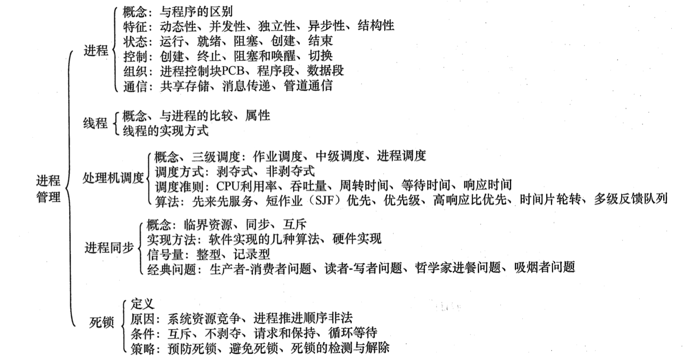

### 2.1 进程和线程
#### 2.1.1 进程的概念和特征
##### 进程的概念
引入进程是为了更好地描述和控制程序的并发执行，实现操作系统的并发性和共享性。

进程控制块（Process Control Block，PCB），用来描述进程的基本情况和运行状态。

程序段，相关数据段，PCB构成了**进程映像（进行实体）**。
创建进程实质就是创建进程实体中的PCB；撤销进程就是撤销进程中的PCB。

进程实体是静态的，进程是动态的。
PCB是进程存在的唯一标志。

**进程的定义：**
- 程序的一次执行过程。
- 一个程序及其数据在处理机上顺序执行时所发生的活动。
- 具有独立功能的程序在一个数据集合上运行的过程，它是系统进行资源分配和调度的一个独立单位。

**进程的特征：**
- 动态性。
- 并发性。
- 独立性
- 异步性
- 结构性：每个进程都配置一个PCB对其进行描述。


#### 2.1.2 进程的状态与转换

进程通常有以下5中状态：
1. 运行态
2. 就绪态
3. 阻塞态
4. 创建态
5. 结束态

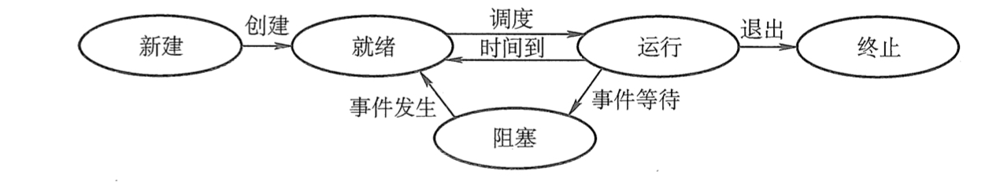

- 就绪态-->运行态：获得CPU资源
- 运行态-->就绪态：时间片用完让出CPU
- 运行态-->阻塞态
- 阻塞态-->就绪态：进程等待的事件到来：I/O操作结束等，中断处理程序将相应进程改为就绪态

#### 2.1.3 进程控制

1. 进程的创建
允许一个进程创建另一个进程，称为父进程/子进程。
撤销父进程时，必须同时撤销所有的子进程；子进程继承父进程拥有的资源。

   - 创建过程：
      1. 为新进程分配一个唯一的进程标识号，申请一个空白的PCB。若申请失败则创建失败。
      2. 为进程分配资源，若资源不足则处于阻塞态，等待资源。
      3. 初始化PCB
      4. 若进程就绪队列能够接纳新进程，则插入就绪队列等待运行。
2. 进程的终止
分为正常结束，异常结束，外接干预。

   - 终止过程：
      1. 根据终止进程的标识符检索PCB
      2. 若处于执行态，则立即终止将资源分配给其他进程。
      3. 若该进程有子进程，则将子进程终止
      4. 将全部资源归还给父进程或归还给操作系统
      5. 删除PCB
3. 进程的阻塞和唤醒
4. 进程切换

#### 2.1.4 进程的组织
1. 进程控制块

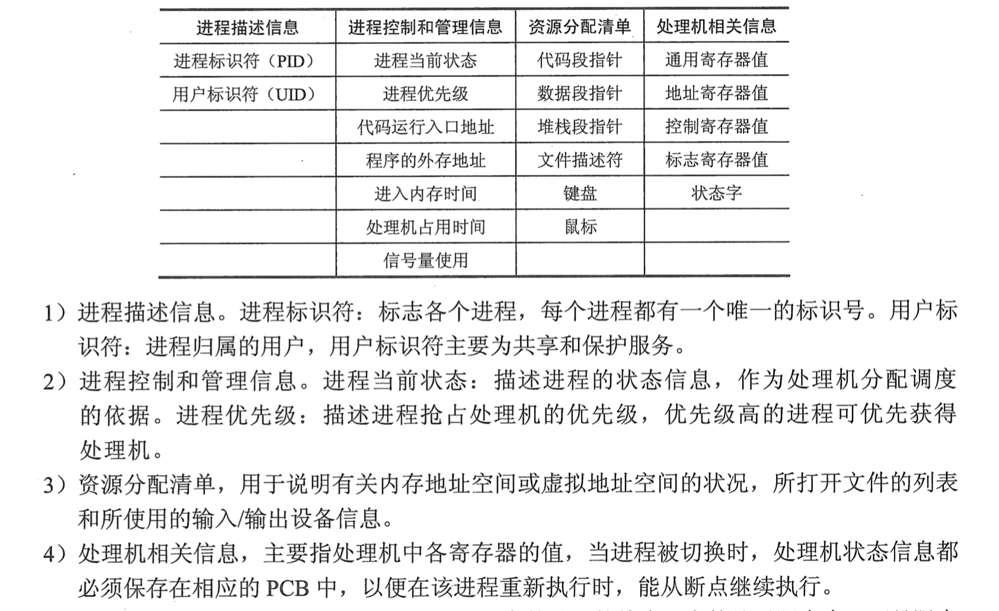

2. 程序段

能被进程调度程序调度到CPU执行的程序代码段。

3. 数据段


#### 2.1.5 进程的通信

#### 2.1.6 线程概念和多线程模型
引入线程的目的是为了减小程序在并发执行时所付出的时空开销，提高操作系统的并发性能。

线程可理解为轻量级进程，是一个基本的CPU执行单元，也是程序执行流的最小单元。

进程是资源分配的最小单位，线程是CPU调度的最小单位。

##### 线程与进程的比较
1. 调度。线程是独立调度的基本单位，进程是拥有资源的基本单位。
2. 拥有资源。线程不拥有资源。
3. 并发性。
4. 系统开销。线程切换时开销很小。
5. 地址空间和其他资源。
6. 通信方面。


##### 多线程模型
1. 多对一模型。
2. 一对一模型。
3. 多对多模型。


### 2.2 处理机调度
#### 2.2.1 调度的概念
一般进程的数量多于处理机的个数，争用处理机的情况在所难免。处理机调度就是对处理机进行分配，从就绪队列中按照一定的算法选择一个进程并将处理机分配给它运行，以实现进程并发地执行。

##### 调度的层次
- 作业调度（高级调度）
按一定的原则从外存上处于后备状态的作业中挑选作业，给其分配内存，I/O设备等资源并建立进程。
属于内存与辅存之间的调度。

- 中级调度（内存调度）
为了提高内存利用率和系统吞吐量。将那些暂时不能运行的进程调至外存等待，此时称为挂起态。

- 进程调度（低级调度）
从就绪队列中选取一个进程分配处理机。

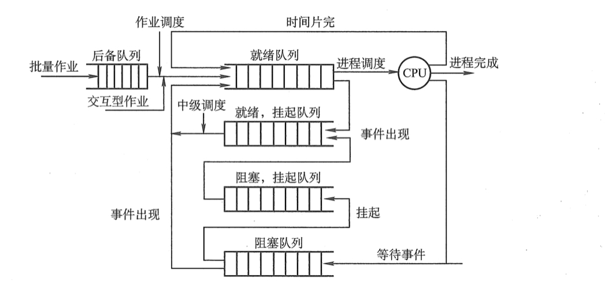

#### 2.2.2 进程调度方式
1. 非剥夺调度方式（非抢占方式）：即使有某个更为重要或紧迫的进程进入就绪队列，仍然让正在执行的进程继续执行，直到该进程完成或发生某种事件而进入阻塞态。
2. 剥夺调度方式（抢占方式）：立即暂停正在执行的进程。

#### 2.2.3 调度的基本准则
- CPU利用率
- 系统吞吐量：单位时间内CPU完成作业的数量
- 周转时间：从作业提交到作业完成所经历的时间
  - 作业完成时间-作业提交时间
  - 作业等待、在就绪队列中排队、在处理机上运行及进行输入/输出操作花费时间的总和
- 带权周转时间=作业周转时间/作业实际运行时间
- 等待时间
- 响应时间：从用户提交请求到系统首次产生响应所用的时间。


#### 2.2.4 典型的调度算法
##### 先来先服务（FCFS）
算法每次从后备作业中选择最先进入该队列的一个或几个作业。

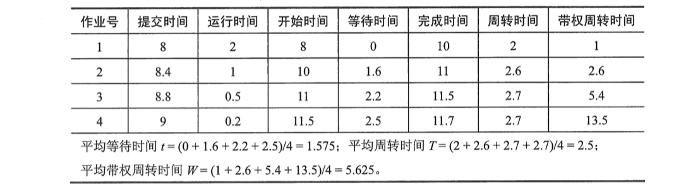

FCFS属于不可剥夺算法，当一个长作业到达系统时，就会使后面的许多短作业等待很长时间。因此不能作为**分时系统**和**实时系统**的主要调度策略。

##### 短作业优先（SJF）
对短作业优先调度。

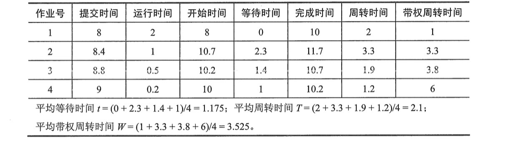

缺点：
1. 对长作业不利
2. 未考虑作业的紧迫程度


##### 优先级调度算法
根据能否抢占分为：
1. 非剥夺式优先级调度算法
2. 剥夺式优先级调度算法

根据优先级能否改变分为：
1. 静态优先级
2. 动态优先级

##### 高响应比优先调度算法

响应比Rp=（等待时间+要求服务时间）/（要求服务时间）


##### 时间片轮转算法
将就绪进程按到达时间的次序排成一个队列，并分配时间片。
##### 多级反馈队列调度算法
实现思想：
- 设置多个就绪队列
- 赋予每个队列时间片的大小各不相同
- 进程进入内存后，先放入第一级的末尾，按FCFS原则等待调度
- 当第一级队列空时，调度第二级队列

### 2.3 进程同步
#### 2.3.1 进程同步的概念
- 临界资源：
许多资源一次只能为一个进程所用，称为临界资源。
```{class=line-numbers}
do{
    entry section;      //进入区
    critical section;   //临界区
    exit section;       //退出区
    remainder section;  //剩余区
}while(true)
```

- 同步：
也称为直接而制约关系。因为需要协调工作次序而等待、传递信息所产生的制约关系等。
- 互斥：
也称为间接制约关系。当一个进程进入临界区使用临界资源时，另一个进程必须等待。

同步机制遵循以下准则：
1. 空闲让进
2. 忙则等待
3. 有限等待
4. 让权等待。当进程不能进入临界区时，应立即释放处理器，防止进程忙等待。

#### 2.3.2 临界区互斥实现基本方法
##### 软件实现方法：
在进入区设置一个标志标明是否有进程在临界区中。
1. 单标志法。

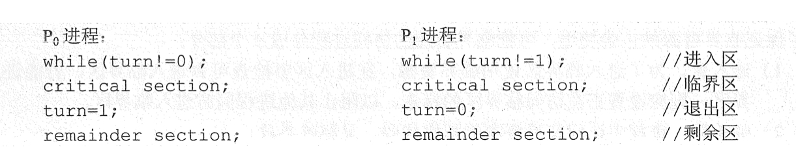


2. 双标志先检查。

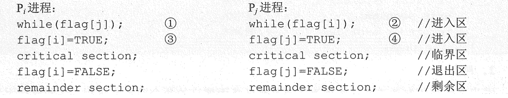

3. 双标志后检查。

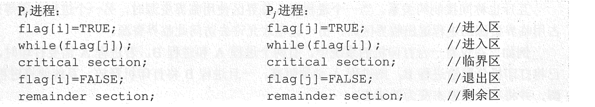

4. Peterson's Algorithm

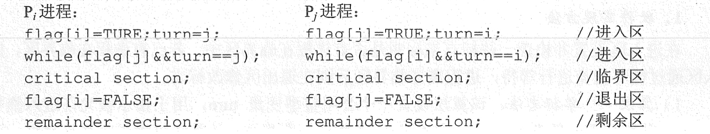

##### 硬件实现方法：
1. 中断屏蔽方法

当一个进程在执行临界区代码时，禁止一切中断发生。CPU只在中断发生时引起进程切换。

2. 硬件指令方法

- TestAndSet指令
- Swap指令

#### 2.3.3 信号量
信号量机制只能被两个标准的原语wait(S)和signal(S)访问，也可记为“P”和“V”操作。
##### 整型信号量
```{class=line-numbers}
wait(S){
    while(S<=0);
    S=S-1;
}
signal(S){
    S=S+1;
}
```

##### 记录型信号量

##### 利用信号量实现同步
##### 利用信号量实现进程互斥
##### 利用信号量实现前驱关系
##### 分析进程同步和互斥问题的方法步骤

#### 2.3.4 管程
##### 管程的定义
代表资源的数据结构，以及由对该共享数据结构实施操作的一组过程所组成的资源管理程序，叫做管程(monitor)

### 2.4 死锁
#### 2.4.1 死锁的概念
> 死锁是指多个进程因竞争资源而造成的一种僵局(互相等待)，若无外力作用，这些进程都将无法向前推进。

##### 死锁产生的原因
1. 系统资源的竞争
2. 进程推进顺序非法
3. 死锁产生的必要条件
   - 互斥条件
   - 不剥夺条件
   - 请求并保持条件
   - 循环等待条件
#### 死锁的处理策略
1. 死锁预防
2. 避免死锁
3. 死锁的检测及解除
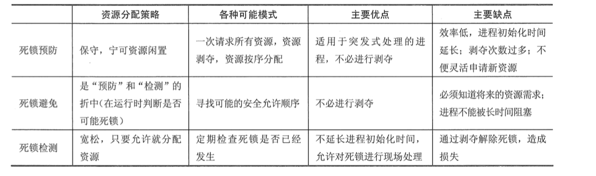

##### 死锁预防
破坏死锁产生的4个必要条件之一即可。
##### 死锁避免
1. 系统安全状态
> 安全状态是指系统能按某种进程推进顺序(P1,P2,...,Pn)为每个进程Pi分配其所需的资源，直至满足每个进程对资源的最大需求，使每个进程都可顺序完成。

2. 银行家算法
   - 数据结构描述：
     - 可利用资源量Available：Available[j]=k，系统中Rj类资源有K个。
     - 最大需求矩阵Max：Max[i,j]=K，表示进程i需要Rj类资源k个。
     - 分配矩阵Allocation：Allocation[i,j]=k，表示进程i当前已分得Rj类资源的数据为K。
     - 需求矩阵Need：Need[i,j]=k，表示进程i还需要Rj类资源k个。
   - 银行家算法描述：
     设Requesti是进程Pi的请求向量，当Pi发出资源请求后，系统按下述步骤检查。
     1. 若Requesti[j]≤Need[i,j]转向步骤2，否则认为出错。
     2. 若Requesi[j]≤Available[j]，则转向步骤3，否则Pi等待
     3. 修改数值
        1. Available=Available-Requesti
        2. Allocation[i,j]=Allocation[i,j]+Requesti[j]
        3. Need[i,j]=Need[i,j]-Requesti[j]
     4. 系统执行安全性算法，判定是否处于安全状态，若处于则完成分配，否则分配作废，pi等待
   - 安全性算法：
    设置工作向量work表示系统中剩余可用资源数目，开始时work=Available
   - 举例
   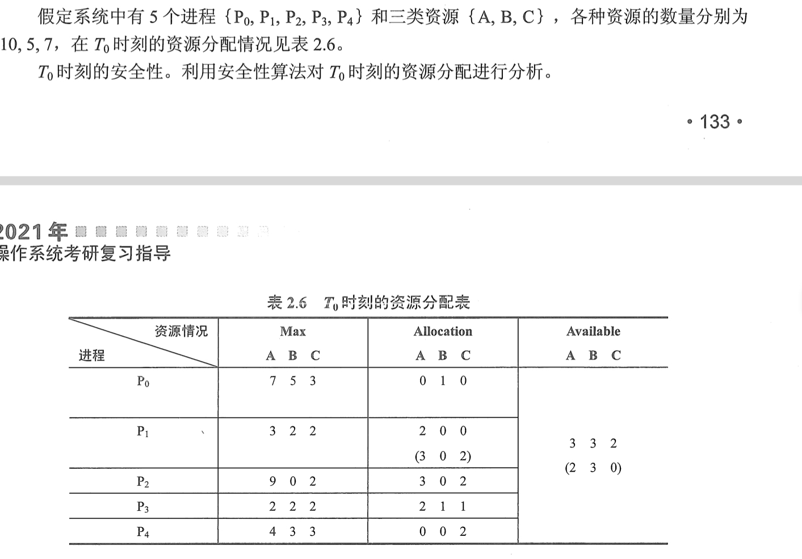
   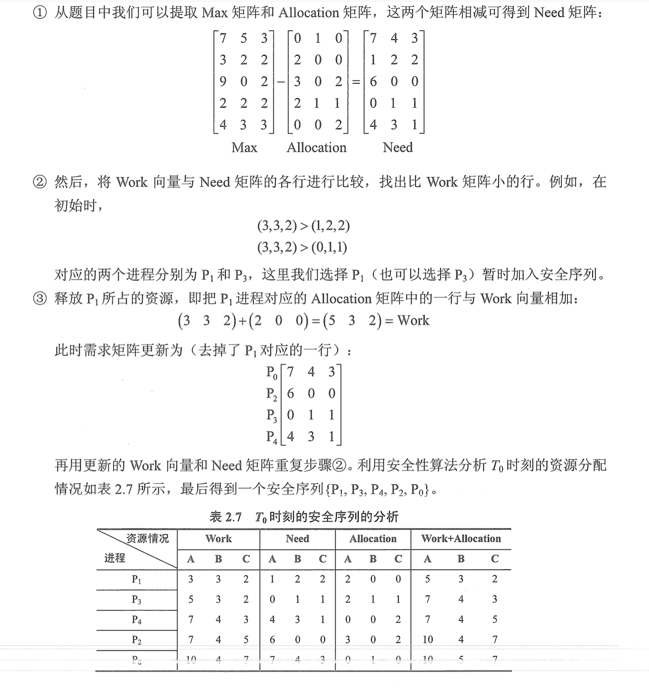

##### 死锁检测和接触
1. 资源分配图
    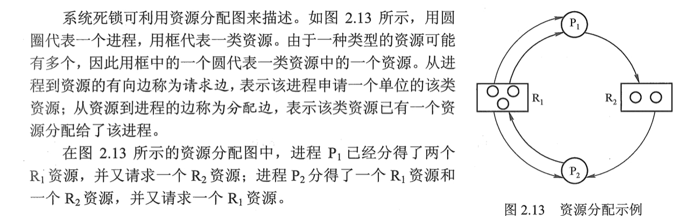
2. 死锁定理
    
3. 死锁解除
   - 资源剥夺法
   - 撤销进程法
   - 进程回退法


## 第三章 内存管理
