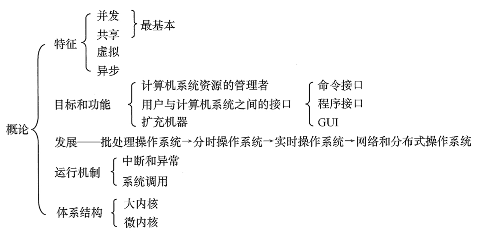

<!-- @import "[TOC]" {cmd="toc" depthFrom=1 depthTo=6 orderedList=false} -->

<!-- code_chunk_output -->

- [计算机操作系统](#计算机操作系统)
  - [第一章 计算机系统概述](#第一章-计算机系统概述)
    - [知识框架](#知识框架)
    - [1.1 操作系统的基本概念](#11-操作系统的基本概念)
    - [1.2 操作系统的发展与分类](#12-操作系统的发展与分类)
      - [手工操作阶段（此阶段无操作系统）](#手工操作阶段此阶段无操作系统)
      - [批处理阶段（操作系统开始出现）](#批处理阶段操作系统开始出现)
      - [分时操作系统](#分时操作系统)
      - [实时操作系统](#实时操作系统)
        - [硬实时系统：某个动作必须绝对地在规定的时刻发生](#硬实时系统某个动作必须绝对地在规定的时刻发生)
        - [软实时系统：能够接受偶尔违反时间规定且不会引起任何永久性的损害。](#软实时系统能够接受偶尔违反时间规定且不会引起任何永久性的损害)
      - [网络操作系统和分布式计算机系统](#网络操作系统和分布式计算机系统)
      - [个人计算机操作系统](#个人计算机操作系统)

<!-- /code_chunk_output -->

# 计算机操作系统
## 第一章 计算机系统概述
### 知识框架

### 1.1 操作系统的基本概念
- 操作系统大致分为四部分：硬件，操作系统，应用程序 ，用户。

> 操作系统是指控制和管理整个计算机系统的硬件与软件资源，合理地组织、调度计算机的工作与资源的分配，进而为用户和其他软件提供方便接口与环境的程序集合。

> 操作系统是计算机系统中最基本的系统软件。

- 特征：
  - 并发(Concurrence)：两个或多个事件在同一时间间隔内发生。
    - 宏观上多道程序同时执行，微观上仍是分时交替执行。
    - 并行是指系统具有同时进行运算或操作的特性。
  - 共享(Sharing)
    - 互斥共享方式：一段时间内只允许一个进程访问该资源（打印机，磁带机）
      - 这种资源称作临界资源或独占资源。
    - 同时访问方式：宏观上同时，微观上交替访问。
  - 虚拟(Virtual)：把一个物理上的实体变为若干逻辑上的对应物。
  - 异步(Asynchronism)：程序并发，但是走走停停不是一贯到底，以不可预知的速度向前推进。

- 操作系统的目标和功能：
  - 作为计算机系统资源的管理者。
    - 处理器管理
    - 存储器管理
    - 文件管理
    - 设备管理
  - 作为用户与计算机硬件系统之间的接口。
    - 命令接口
    - 程序接口
  - 作为扩充机器。

### 1.2 操作系统的发展与分类
#### 手工操作阶段（此阶段无操作系统）

缺点：1.用户独占全机，资源利用率低。2.CPU等待手工操作，利用不充分。

#### 批处理阶段（操作系统开始出现）

1. 单道批处理系统
    - 自动性
    - 顺序性
    - 单道性

缺点：高速CPU需要等待低速I/O完成状态。

2. 多道批处理系统
    - 多道
    - 宏观上并行
    - 微观上串行

#### 分时操作系统
将CPU的运行时间分成很短的时间片，按时间片轮流把处理器分配给作业使用。
- 同时性
- 交互性
- 独立性
- 及时性
#### 实时操作系统
##### 硬实时系统：某个动作必须绝对地在规定的时刻发生
##### 软实时系统：能够接受偶尔违反时间规定且不会引起任何永久性的损害。

#### 网络操作系统和分布式计算机系统
#### 个人计算机操作系统
Windows，Linux，Macintosh。